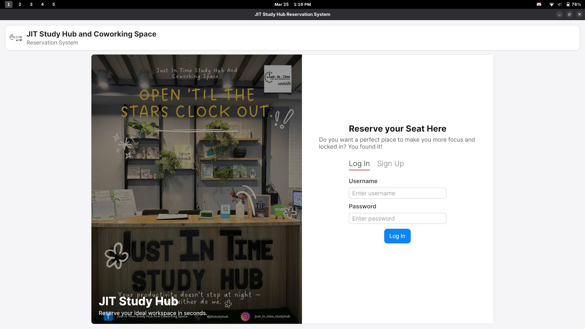
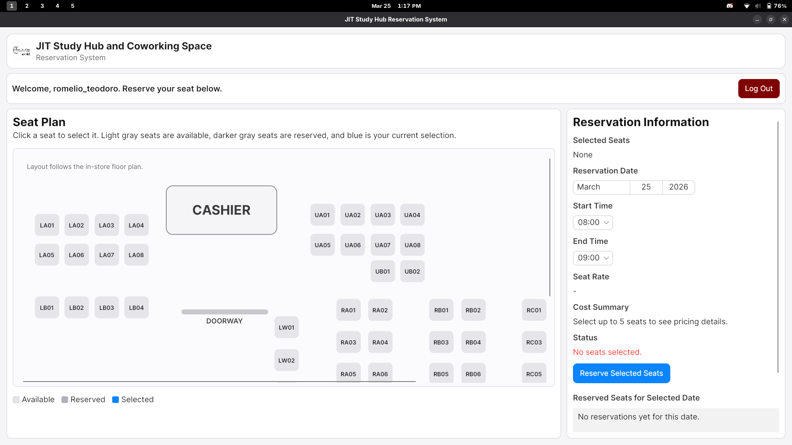

# Study Hub Reservation System

This repository contains a desktop application for managing study hub seat reservations. This application was developed as my **final project for IT Elective 2**.

## Overview

The Study Hub Reservation System is built with **C#**, **.NET 10**, and **Avalonia UI**. It provides a simple flow for users to sign up, log in, and reserve study seats for a chosen date and time.

### Key Features

- User sign up and login
- Password hashing using SHA-256
- Seat reservation by date, start hour, and duration
- Reservation conflict detection (prevents overlapping reservations for the same seat)
- Reservation cost tracking (hourly rate and total cost)
- Local JSON-based data storage in `Database/users.json` and `Database/reservations.json`

## Screenshots

### Login Page



### Main Reservation Page



## Project Structure

- `Models/` : Data models for users and reservations
- `Services/` : Core data and business logic (`AppDataStore`)
- `Database/` : JSON files used for persistent local storage
- `Assets/` : Application images and screenshot files

## How To Run

### Prerequisites

- .NET 10 SDK installed

### Steps

1. Clone the repository.
2. Open the project folder in your terminal.
3. Restore dependencies:

```bash
dotnet restore
```

4. Run the application:

```bash
dotnet run --project study_hub_reservation_system.csproj
```

## Data Files

The app stores user and reservation data in the `Database/` folder:

- `Database/users.json`
- `Database/reservations.json`

If these files do not exist yet, they are created automatically when needed.
